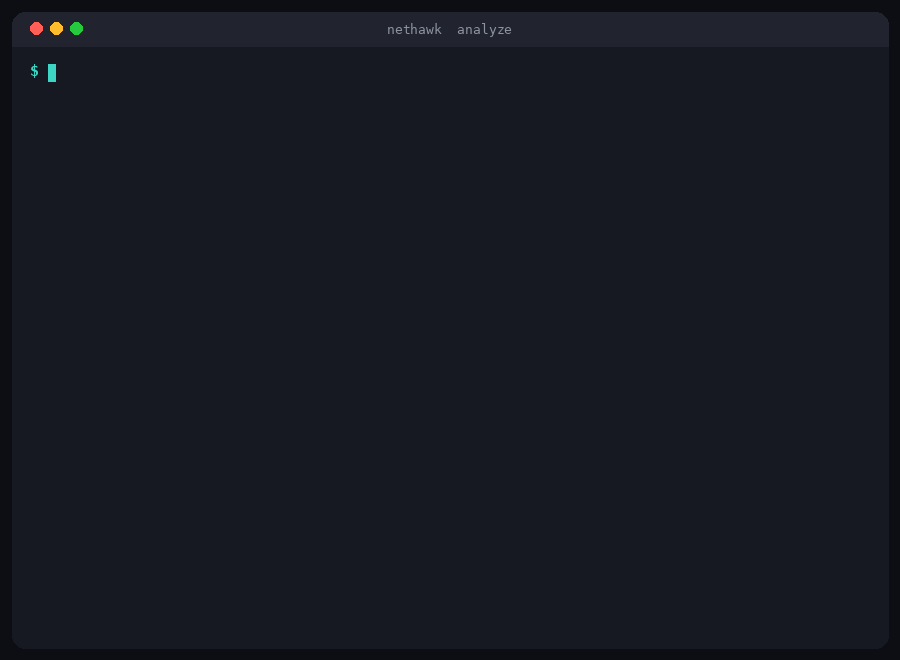
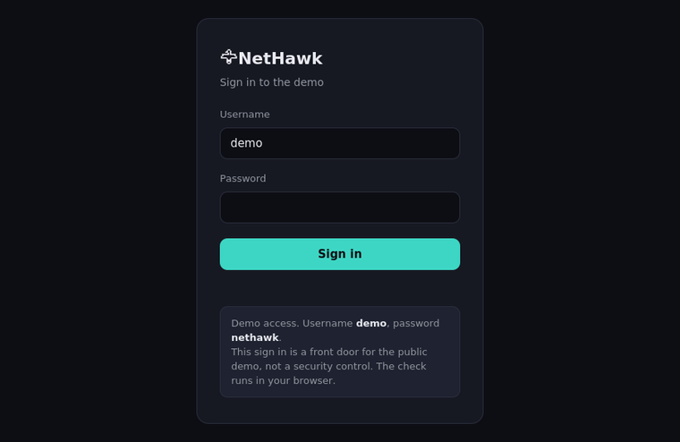
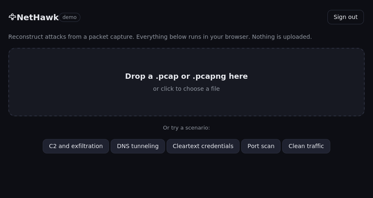
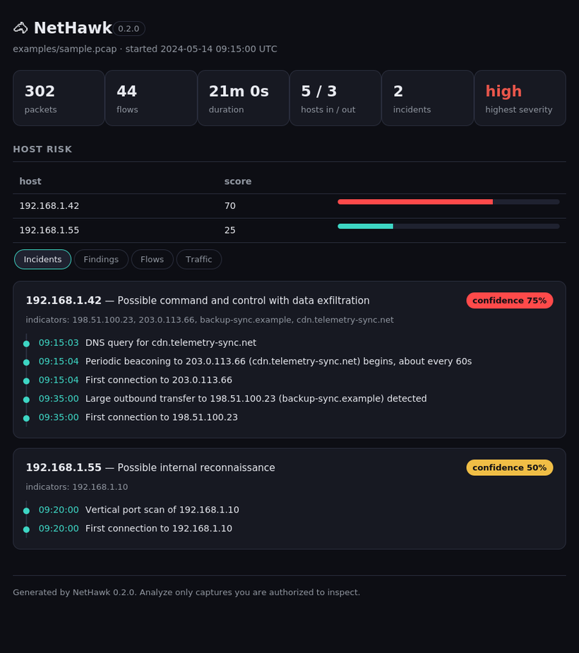
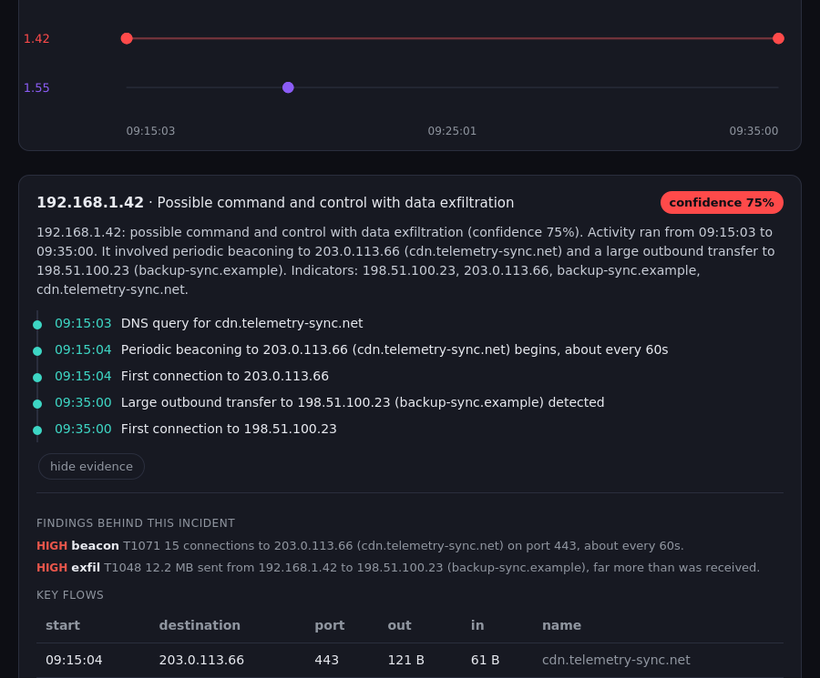
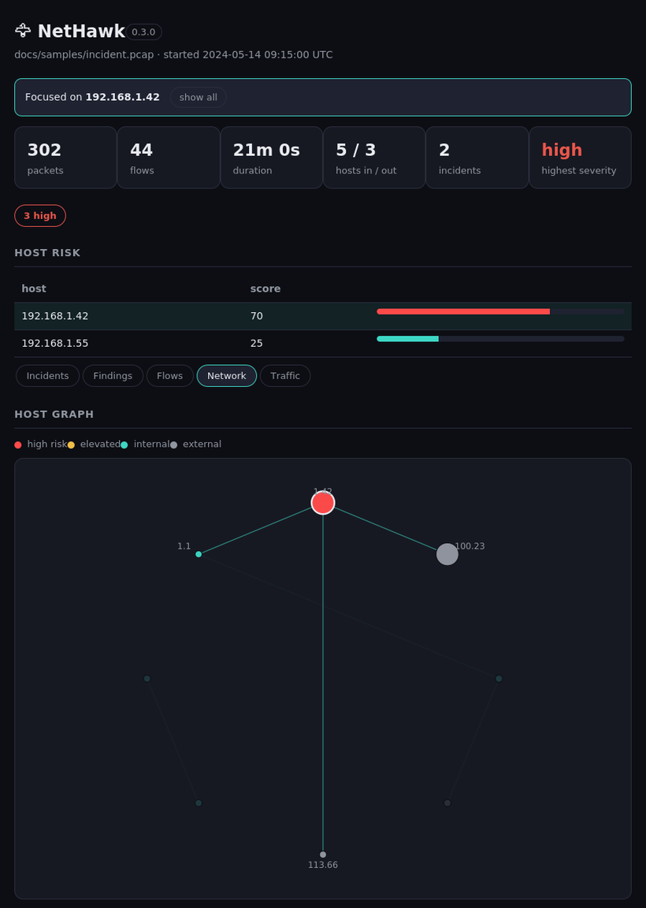
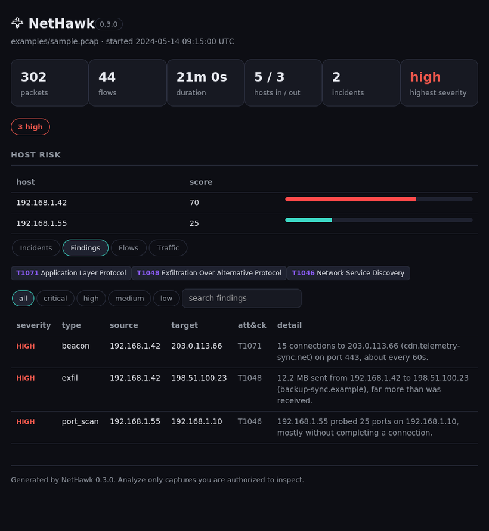
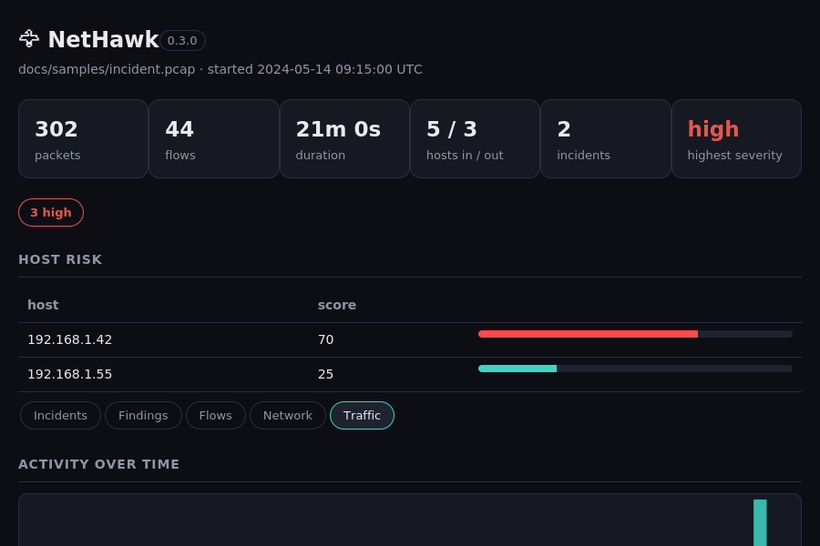
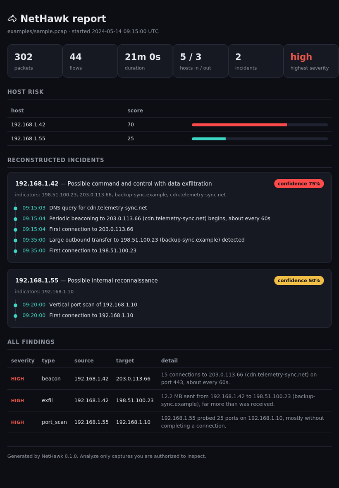

<div align="center">

# 🦅 NetHawk

### Reconstruct attacks from a packet capture

Drop in a capture and NetHawk rebuilds the conversations, flags the suspicious behavior, and correlates it into incidents, each with a timeline, a confidence score, and a plain English writeup. Not a wall of alerts, but a short answer to what happened, on which host, and how sure it is.

[](https://siteq8.github.io/NetHawk/)
[](https://github.com/SiteQ8/NetHawk/releases/latest)


**[Try it live in your browser](https://siteq8.github.io/NetHawk/)** (no install, and nothing you open is uploaded)

<br>



</div>

## Why you would use it

* **Answers, not alerts.** Each incident becomes a timeline with a confidence score and a plain English summary you can paste straight into a ticket.
* **Installs nothing.** One zero dependency Python tool, plus a browser demo that needs no install at all.
* **Reads real captures.** pcap and pcapng in either byte order, IPv4 and IPv6, VLAN and QinQ, checked against more than eighty real captures.
* **Private by default.** The browser demo analyzes your capture locally and never uploads it, and the tool only ever reads captures, never sends traffic.
* **Fast on real captures.** It analyzes around 800,000 packets from a 350 MB capture in under ten seconds using about 130 MB of memory, because it streams the capture rather than loading it all at once.
* **Nothing to take on trust.** Every finding shows the evidence behind it and maps to a MITRE ATT&CK technique.

## Live demo

Open [the hosted demo](https://siteq8.github.io/NetHawk/) and press **Enter the demo**; the credentials are already filled in. Then pick a scenario, an intrusion with command and control and exfiltration, DNS tunneling, credentials sent in clear text, a port scan, or clean traffic with nothing to find, or drop your own capture. The analysis engine is ported to JavaScript and runs client side, so nothing you open leaves your browser. The view is shareable too: the address bar updates as you pick a scenario, switch tabs, and focus a host, so a link reopens exactly what you were looking at.

<div align="center">

<br><br>

</div>

NetHawk reads pcap and pcapng in either byte order, and decodes Ethernet (including stacked VLAN and 802.1ad QinQ tags), Linux cooked capture, raw IP, IPv4 and IPv6, and TCP, UDP, and ICMP. It has been run against more than eighty real captures from the tcpdump test corpus without crashing.

## The web GUI

Run `nethawk serve` and open the printed address. Drop a capture into the page and it is analyzed locally: summary cards, host risk, reconstructed incidents each written up as a plain English summary with a visual attack timeline, a findings list with the observed ATT&CK techniques grouped by tactic, a host graph, a flows explorer, and traffic statistics with an activity over time chart. Expand any incident to see the exact findings and flows behind it, so nothing is a black box. Click any host, in the risk table, the graph, or an incident, and every view focuses on it: the findings and flows filter to that host and the graph highlights it and its neighbors. Keyboard shortcuts move you around fast: number keys switch tabs, the arrow keys step through hosts by risk, and escape clears the focus. You can export the result as JSON, as a list of indicators, or as a standalone HTML report. The whole interface is one document with no framework and no external resource, served by the standard library. The hosted demo above is the same interface, with the engine compiled to run in the browser.

<div align="center">

<br><br>

<br><br>

<br><br>

<br><br>

</div>

```bash
nethawk serve            # then open http://127.0.0.1:8080
nethawk serve --open     # and open it in your browser automatically
```

## What makes it different

Most tools stop at "suspicious traffic detected." NetHawk goes one step further and reconstructs the attack. It links the DNS lookup, the first connection, the periodic beaconing, and the large upload into a single ordered account, and it tells you how confident it is:

```
[1] 192.168.1.42  Possible command and control with data exfiltration  confidence 87%
    09:15:03  DNS query for cdn.telemetry-sync.net
    09:15:04  Periodic beaconing to 203.0.113.66 begins, about every 60s
    09:15:04  First connection to 203.0.113.66
    09:35:12  Large outbound transfer to 198.51.100.23 detected
```

That is the whole idea: turn packets into a narrative a responder can act on.

## Why NetHawk

Threat hunting in a capture usually means loading it into a heavy tool, clicking through thousands of packets, and holding the whole picture in your head. NetHawk does the first pass for you. It surfaces the handful of hosts worth looking at, explains why each one is flagged, and shows the sequence of events. Because it uses only the Python standard library, there is no dependency tree to vet before you run it on sensitive evidence, and it works the same on an air gapped machine as it does on your laptop.

## The dashboard

Every analysis can be written to a single self contained HTML file, with no external resources, that you can open anywhere or attach to a ticket.

<div align="center">

</div>

## What it detects

* Port scans, both vertical against one host and sweeps across many hosts.
* DNS tunneling, from many high entropy subdomains under one parent name.
* High rates of failed lookups, which can point to algorithmically generated domains.
* Periodic beaconing, from the regularity of the intervals between connections.
* Large outbound transfers that look like data leaving.
* Credentials sent in clear text over HTTP.
* Sensitive services in clear text, such as FTP and Telnet.
* Long lived connections that can hide a tunnel.
* Automation user agents such as curl, wget, and python requests.
* A single host reaching an unusually large number of external destinations.
* Contact with any indicator you supply in a list.

Every finding carries the evidence that produced it and the MITRE ATT&CK technique it maps to, so nothing is a black box.

## Install

From the latest [release](https://github.com/SiteQ8/NetHawk/releases/latest), download the wheel and install it:

```bash
pip install nethawk-0.3.0-py3-none-any.whl
```

With pipx, straight from the repository:

```bash
pipx install git+https://github.com/SiteQ8/NetHawk.git
```

Or with pip from a clone:

```bash
git clone https://github.com/SiteQ8/NetHawk.git
cd NetHawk
pip install .
```

You can also run it without installing anything, since it uses only the standard library:

```bash
git clone https://github.com/SiteQ8/NetHawk.git
cd NetHawk
python -m nethawk analyze capture.pcap
```

## Quick start

Try it on the sample capture that ships with the project. Generate it once, then analyze it:

```bash
python examples/make_sample.py
nethawk analyze examples/sample.pcap
```

You will see the compromised host, its command and control timeline, the large upload that follows, and a separate host running a port scan.

## Usage

Write a machine readable report:

```bash
nethawk analyze capture.pcap --format json > report.json
```

Write the standalone HTML dashboard:

```bash
nethawk analyze capture.pcap --format html -o report.html
```

Match traffic against your own indicators, one IP or domain per line:

```bash
nethawk analyze capture.pcap --iocs iocs.txt
```

Tune the thresholds when a capture is noisy or unusually quiet:

```bash
nethawk analyze capture.pcap \
  --beacon-min-conns 8 \
  --exfil-min-bytes 20000000 \
  --scan-min-ports 25
```

List the conversations in a capture, sorted by volume:

```bash
nethawk flows capture.pcap --sort bytes --limit 40
```

Open the web dashboard, or use it as a JSON API:

```bash
nethawk serve
# then, from anywhere:
curl --data-binary @capture.pcap http://127.0.0.1:8080/api/analyze
```

The API returns the same structured result as the json report, so you can wire NetHawk into other tools without changing its zero dependency core. The server binds to localhost by default.

## How it works

NetHawk runs a simple pipeline:

```
capture -> decode -> flows -> detect -> correlate -> score -> report
```

It reads the capture with its own pcap and pcapng parser, decodes each packet down to the transport layer, and pulls out DNS names and answers, the TLS server name, and HTTP hosts along the way. It groups packets into flows, then runs the detectors over the flows and DNS events. The correlation step gathers the findings for each internal host, connects a resolved address back to the name that produced it, and lays the events out in time to form an incident. Each host gets a risk score, and the result is rendered as text, json, or the dashboard.

Because it reads the byte counts from the packet headers, a capture taken with a snaplen still reports transfer sizes correctly even though the payloads are truncated.

## Reducing noise

Detection thresholds are meant to be tuned to your environment. Raise `--beacon-min-conns` or `--scan-min-ports` on a busy network, raise `--exfil-min-bytes` where large transfers are normal, and pass an indicator list with `--iocs` to promote the things you already care about. Every threshold has a sensible default so the tool is useful before you tune anything.

## Responsible use

NetHawk only reads captures. It does not send, inject, or modify traffic. Analyze only captures you are authorized to inspect, such as traffic from your own network or evidence handed to you for an investigation. Used that way, it is a blue team tool for understanding what already happened.

## Exit codes

* `0` the capture was analyzed.
* `2` the file was missing or could not be read as a capture.

## Project layout

```
nethawk/
├── nethawk/
│   ├── cli.py         # command line interface
│   ├── analyzer.py    # the pipeline and risk scoring
│   ├── pcap.py        # pcap and pcapng reader
│   ├── decode.py      # link, network, and transport decoders
│   ├── apps.py        # DNS, TLS server name, and HTTP parsing
│   ├── flows.py       # flow aggregation and host classification
│   ├── detect.py      # the detection engine
│   ├── correlate.py   # incidents and timelines
│   ├── report.py      # text, json, and HTML output
│   ├── serve.py       # the built in web GUI and JSON API
│   └── models.py      # data models
├── tests/             # unit tests with crafted packet fixtures
├── examples/          # a reproducible sample capture generator
└── docs/              # the GitHub Pages demo
    ├── index.html     # the demo page with the sign in gate
    └── app/           # engine.js is the browser port, plus ui.js and styles
```

## Roadmap

See [ROADMAP.md](ROADMAP.md) for what is planned, including live capture, more detectors, and reading Suricata and Zeek telemetry.

## Contributing

Issues and pull requests are welcome. New detectors, better correlation, and more tests are all valuable. See [CONTRIBUTING.md](CONTRIBUTING.md) to get started.

## License

MIT. See [LICENSE](LICENSE). Free to use, change, and share.

<div align="center">

Built by [SiteQ8](https://github.com/SiteQ8). We build open source tools, agents, and technology.

If NetHawk helps you find something in a capture, a star is welcome.

</div>
